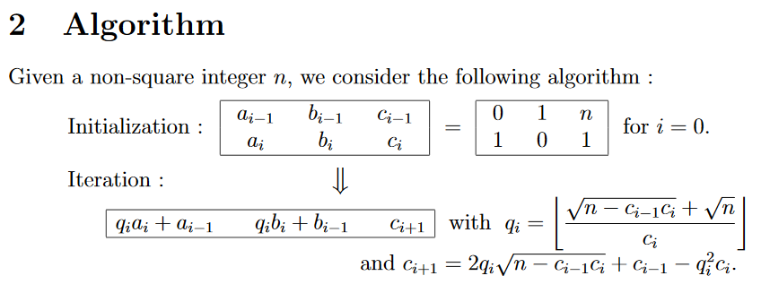

[Problem 66](https://projecteuler.net/problem=66 "Problem 66 - Project Euler")

二次丢番图方程如下
$$
x^2 – Dy^2 = 1
$$
当 $D = 13$ 时，$x$的最小解是
$$
649^2 – 13*180^2 = 1
$$
当 $D$ 是平方数时，无解。

题目中给出了几个示例，当 $D = \{2, 3, 5, 6, 7\}$ 时，列出了 $x$ 的最小解，其中最小解的最大值是 $x = 9$，对应的 $D = 5$。

找到这样一个 $D,D\leq 1000$，使得 $x$ 最小解是最大值。

如果我们能对于某个 $D$，快速找到最小解 $x$。这个题就很容易了。
``` csharp
List<int> D = Enumerable.Range(1, 1000)
                        .Where(i => Math.Pow((int)Math.Sqrt(i), 2) != i)
                        .ToList();
BigInteger max = 0;
long ret = 0;
foreach (var d in D)
{
    BigInteger cur = GetX(d);
    if (max < cur)
    {
        max = cur;
        ret = d;
    }
}
```
现在问题就是如何实现 `GetX`。论文 [An Algorithm to Solve a Pell Equation](http://www.kurims.kyoto-u.ac.jp/EMIS/journals/GMN/yahoo_site_admin/assets/docs/1_GMN-8492-V28N2.190180001.pdf) 给出了一种快速的解法。



接下来，照猫画虎，把算法实现一下。
``` csharp
private static BigInteger GetX(int n)
{
    var a = new List<BigInteger>() { 0, 1 };
    var b = new List<BigInteger>() { 1, 0 };
    var c = new List<int>() { n, 1 };

    int i = 1;
    do
    {
        int q = (int)((Math.Sqrt(n - c[i - 1] * c[i]) + Math.Sqrt(n)) / c[i]);
        c.Add((int)(2 * q * Math.Sqrt(n - c[i - 1] * c[i]) + c[i - 1] - q * q * c[i]));
        a.Add(q * a[i] + a[i - 1]);
        b.Add(q * b[i] + b[i - 1]);
        i++;
    } while (a.Last() * a.Last() - n * b.Last() * b.Last() != 1);

    return a.Last();
}
```
为什么要用 `BigInteger` 类型呢？虽然 $D$ 不大，但是 $x$ 和 $y$ 的值可能会很大，甚至超过 `long` 的表示范围。
