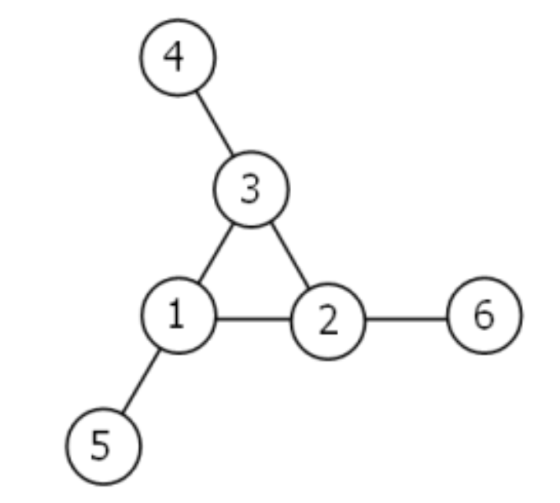
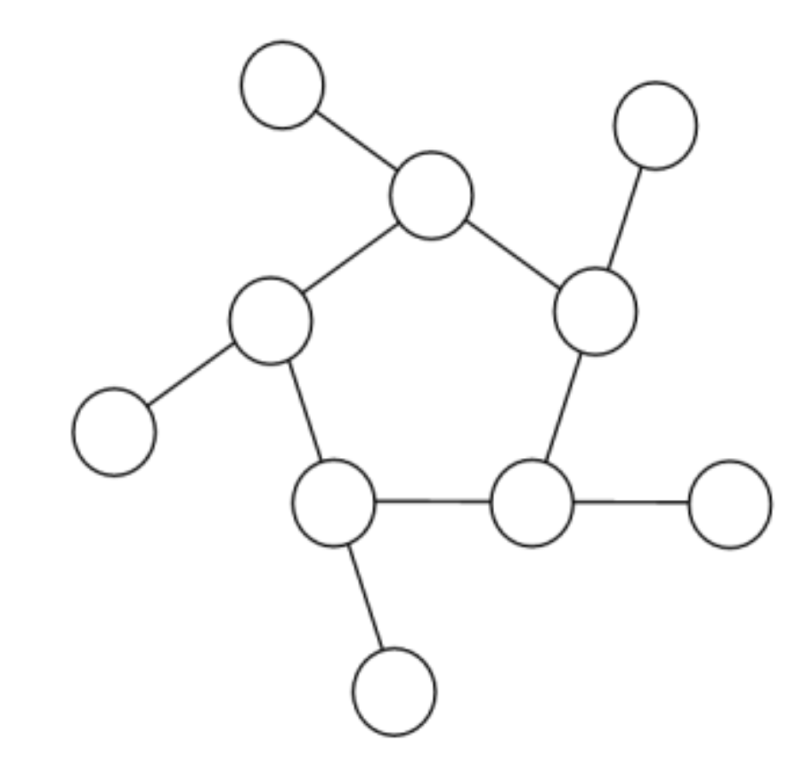
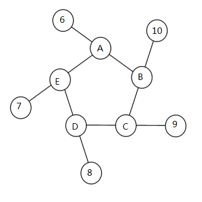

[Problem 68](https://projecteuler.net/problem=68 "Problem 68 - Project Euler")

如下图所示，是一个三重的魔环，每一行之和一样。

将 1-6 六个数字填入。从最小外层数字开始，顺时针循环，将直线上的数字记录下来构成一个集合，那么这个集合可以唯一的描述一种情况。比如上图的集合就是 4,3,2; 6,2,1; 5,1,3。

所有组合只有下面八种情况，和只有四种情况。

| Total | Solution Set |
|--|--|
| 9 | 4,2,3; 5,3,1; 6,1,2 |
| 9 | 4,3,2; 6,2,1; 5,1,3 |
| 10 | 2,3,5; 4,5,1; 6,1,3 |
| 10 | 2,5,3; 6,3,1; 4,1,5 |
| 11 | 1,4,6; 3,6,2; 5,2,4 |
| 11 | 1,6,4; 5,4,2; 3,2,6 |
| 12 | 1,5,6; 2,6,4; 3,4,5 |
| 12 | 1,6,5; 3,5,4; 2,4,6 |

把集合按序写作一个数字的话，最大数字是 432621513。

如果将 1-10 填入下面的五重魔环。结果集合按序写的话，可能是 16 位数字或者是 17 位数字。求 16 位数字中的最大值。

字符串是 16 位，那么数字 10 肯定在外圈，因为内圈的数字会被用两次。

题目一个要求是从外围的最小数开始，现在又要保证字符串最大，那么如果 6,7,8,9,10 都在外圈，字符串就是 6 开头，否则至少是 5 开头，比 6 开头要小，所以要使得其最大化，6,7,8,9,10 都在外圈。

参考三角环中数字最大的形式，4,5,6 三个数字逆时针旋转，于是乎我也如法炮制，让 6,7,8,9,10 挨着并逆时针排列着，如图：

在此基础上，每行最小和是 $10+1+2=13$。我们现在就推理下每行 13 的可行性。

6 和 10 要共享一个数字 B，B 只能是 1 或者 2，那么 6 所在的这一行要想到 13，至少还差 5。此时，B=2，A=5，C=1。

考虑 7 所在的行，$13-7-5=1$。但是 1 已经被用掉了。排除这种情况。

每行的最大和是 $6+5+4=15$。很显然，B 不能是 5，所以 B=4。那么A=5。那么 E=3。那么 D=4。4 已经被用过了。也要排除这种可能性。

那么，每行和就是14了。6 所在的行，只能是一个 5 一个 3。B 又不能是 5。所以 A=5，B=3。那么 C=1。那么 D=4。最后的 E 是2。

根据这种排列，6531031914842725 就是答案了。

虽然每一步推理都很有根据，最后也得到了答案，但是所有推理的基础不不牢靠的：让 6,7,8,9,10 挨着并逆时针排列着。

为什么要挨着排放呢？6 的顺时针右侧是 10 而不是 9 呢？显然 9 比 10 的第一位要大的。为什么呢？一个猜测是没有解，即每个数字用一次，且每行三个数之和一样。
