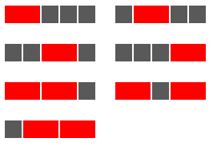

[Problem 116](https://projecteuler.net/problem=116)

一排由 5 块灰色正方形瓷砖组成的长条中，有一部分被红色(长度为 2)、绿色(长度为 3)或蓝色(长度为 4)中的一种颜色的长方形瓷砖所取代。

如果选择了红色，有七种方式：



如果选择了绿色，有三种方式：


如果选择了蓝色，就只有两种方式了：


总共有 12 种方式铺灰色长条。

如果长灰色的长度是 50，那么有多少种铺法呢？

考虑这样一棵三叉树，根节点就是起始点，第一层是第一个格子的颜色，第二层是第二个格子的颜色。三叉的原因是每个格子可以是灰色，也可以是红色的第一块或者红色的第二块。如果父节点是灰色，那么子节点可以是灰色，也可以是红色的第一块；如果是红色第一块，那么子节点只能是红色的第二块；如果是红色第二块，和灰色一样，可以是灰色或者是红色第一块。所以本质上这个三叉树可以用二叉树表示，但是三叉树更容易理解。

那么题目要求的就是第五十层灰色格子和红色第二块格子的个数之和。

我们定义三个数组，`Grey[i], Red1[i], Red2[i]` 表示第 $i$ 层各个颜色格子的个数。那么根据前面的分析：
```
Grey[0]=Red1[0]=1;
Red2[0]=0;

Grey[i+1]=Red1[i+1]=Grey[i]+Red2[i];
Red2[i+1]=Red1[i];
```
可以看出来红色第一格始终和灰色格子的个数相等，但是我实现代码的时候并没有简化，因为完全写出来更直观。
``` csharp
private static long GetRedCount()
{
    var reds = new long[3, Layer];
    reds[0, 0] = 1;
    reds[1, 0] = 1;
    reds[2, 0] = 0;

    for (int i = 1; i < Layer; i++)
    {
        reds[1, i] = reds[0, i] = reds[0, i - 1] + reds[2, i - 1];
        reds[2, i] = reds[1, i - 1];
    }

    return reds[0, Layer - 1] + reds[2, Layer - 1] - 1;
}
```
`Grey` 和 `Red2` 来回相加，本质上就是斐波那契数列，那么这个题目的红色可以用一个数组完成，但是我觉得也没有必要。

另外，最后减一的原因是根据题意，全是灰色，也就是一个红色瓷砖都不用是不允许的。

红色解决之后，类似的，绿色就是四叉树，蓝色是五叉树。不再赘述。
