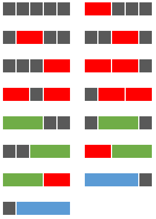

[Problem 117](https://projecteuler.net/problem=117)

这个题目比 116 略微复杂一点，可以用三种颜色的瓷砖一起铺长度为 50 的灰色长条。回到长度为 5 的灰色长条，有十五种方式，特别提醒下，这个题目和 116 题不一样的地方是允许全是灰色。



其实和 116 分析基本一致，想成一个十叉树（1 灰，2 红，3 绿，4 蓝）就好了。
```csharp
var reds = new long[3, Layer];
var greens = new long[4, Layer];
var blues = new long[5, Layer];
reds[0, 0] = 1;
reds[1, 0] = 1;
reds[2, 0] = 0;
greens[0, 0] = 1;
greens[1, 0] = 1;
greens[2, 0] = 0;
greens[3, 0] = 0;
blues[0, 0] = 1;
blues[1, 0] = 1;
blues[2, 0] = 0;
blues[3, 0] = 0;
blues[4, 0] = 0;

for (int i = 1; i < Layer; i++)
{
    long next_blank = reds[0, i - 1] + reds[2, i - 1] + greens[3, i - 1] + blues[4, i - 1];
    reds[1, i] = reds[0, i] = next_blank;
    greens[1, i] = greens[0, i] = next_blank;
    blues[1, i] = blues[0, i] = next_blank;

    reds[2, i] = reds[1, i - 1];
    greens[2, i] = greens[1, i - 1];
    greens[3, i] = greens[2, i - 1];
    blues[2, i] = blues[1, i - 1];
    blues[3, i] = blues[2, i - 1];
    blues[4, i] = blues[3, i - 1];
}

long result = reds[0, Layer - 1] + reds[2, Layer - 1] + greens[3, Layer - 1] + blues[4, Layer - 1];
```
