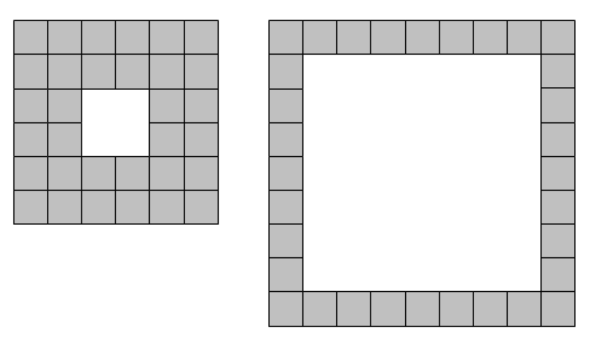

[Problem 173](https://projecteuler.net/problem=173 "Problem 173 - Project Euler")

如下图所示，瓷砖可以贴成中间一个正方形洞的正方形图案。下面是 32 个瓷砖可能的两种组合。



使用 100 个瓷砖，不必完全用完，有 41 种不同的正方形图案。

问最多用一百万个瓷砖，有多少种不同的图案？

这个题比较简单。假定中间的洞的长度是 $d$，那么外面第一层的长度是 $d+2$，但是看作是 $d+1$ 比较容易计算瓷砖数，再外层长度是 $d+1+2$，依次类推。

给定 $d$，最内层长度是 $\min=d+1$，最外层长度是 $\max=d+1+2*n$，$n$ 可以从 0 开始直到总瓷砖个数
$$\text{total}=\frac{(\min+\max)*n}{2}$$
超过一百万。如果 $\text{total}$ 小于一百万，那么这就是唯一的一种正方形图案。

对 $d$ 遍历，求和，即可得到答案。
```csharp
for (int hole = 1; hole < N / 4; hole++)
{
    int min_length = hole + 1;

    for (int max_length = min_length; ; max_length += 2)
    {
        int a_1 = min_length;
        int a_n = max_length;
        int n = (a_n - a_1) / 2 + 1;
        int total = (a_1 + a_n) * n / 2 * 4;
        if (total <= N)
        {
            count++;
        }
        else
        {
            break;
        }
    }
}
```
这个题目还有一个优化点，无需内层的 `for` 循环，可以通过代数运算得到 `max_length`，那么对于给定的 $d$，`count` 数就是 `(max-min)/2`。不过运行发现上述代码足够快，不到 10ms 就出结果了，未再修改。

