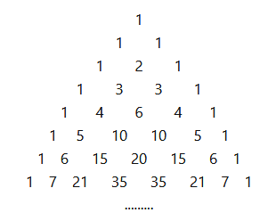

[Problem 203](https://projecteuler.net/problem=203)

二项式系数 $\begin{pmatrix}n\\k\end{pmatrix}$ 可以写成如下帕斯卡三角的形式



前八排有 12 个不同的数：1, 2, 3, 4, 5, 6, 7, 10, 15, 20, 21 和 35。

Squarefree 的意思是不能被任何质数的平方整除。前八排的数字里面，4 和 20 不是 Squarefree 的，因为它们能被质数 2 的平方整除。

求帕斯卡三角前 51 排不重复的 Squarefree 的数之和。

我们先来估计下最大的数是多少，然后考虑用什么类型表示，第五十一行其实是 $n=50$，那么最大的是数
$$\begin{pmatrix}n\\k\end{pmatrix}=\begin{pmatrix}50\\25\end{pmatrix}=\frac{50!}{25!25!}=126,410,606,437,752$$
`long` 就足够了。

首先我们计算前 51 排的数。
``` csharp
var rows = new List<long[]>();
for (int i = 0; i < 51; i++)
{
    long[] row = new long[i + 1];
    for (int j = 0; j < row.Length; j++)
    {
        if (j == 0 || j == row.Length - 1)
        {
            row[j] = 1;
        }
        else
        {
            var lastRow = rows[i - 1];
            row[j] = lastRow[j - 1] + lastRow[j];
        }
    }

    rows.Add(row);
}
```
下一步去重。
``` csharp
var candidates = rows.SelectMany(l => l).Distinct().ToList();
```
要考虑那些质数的平方呢？仔细想下前 51 排数的性质，只需要考虑很少几个数就足够了。
``` csharp
var smallPrimeSquare = new int[] { 4, 9, 25, 49 };
```
如果某个数能被下一个质数的平方 121 整除，那么 $n$ 至少要是 22，这样子二项式系数的分子上才会出现 2 个 11，但是不管 $k$ 怎么取，分母上都至少有一个 11 这个因数。那么 $n$ 至少要是 33 了，不管 $k$ 怎么取，分子上都至少有两个 11 这个因数。那么 $n$ 至少要是 44 了，同理，也无法被 121 整除。总结下，分母上 11 的因数的个数至少是分子上 11 的因数的个数减一。其实，结论很容易直接证明的。

那么为什么需要考虑 49 呢？很简单，49 包含了两个 7，那么 $n$ 取 49 和 50 的时候，有可能分子因数 7 的个数能够比分母多两个。那么该数就能被 49 整除，进而不是 Squarefree 的。

最后，排除 Squarefree 的数字再求和即可。
``` csharp
candidates = candidates.Where(l =>
{
    foreach (var square in smallPrimeSquare)
    {
        if (l % square == 0)
        {
            return false;
        }
    }

    return true;
}).ToList();

return candidates.Sum();
```
