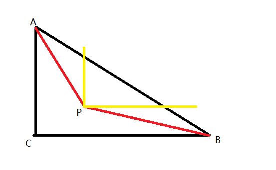
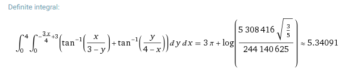

[Problem 613](https://projecteuler.net/problem=613 "Problem 613 - Project Euler")

题目是毕达哥拉斯蚂蚁，用我们的说法是勾股蚂蚁。

有个小蚂蚁落到了一个宽 30cm，长 40cm 的直角三角形上，它会随机的选择一个方向爬，问从斜边爬出去的概率是多少。

上图是一个示意图，$x$ 轴的长度是 4，$y$ 轴长度是 3。把题目的 30，40 缩放为 3，4，对求概率是没有影响的。

假设落到点 $P(x, y)$，那么它从斜边爬出去的概率是多少呢？

角 PAC 的大小是 $\arctan(x/(3-y))$，角 PBC 的大小是 $\arctan(y/(4-x))$，那么角 APB 的大小是 $\pi/2+\arctan(x/(3-y))+\arctan(y/(4-x))$，那么从点 $P$ 开始从斜边爬出去的概率就是 $\pi/2+\arctan(x/(3-y))+\arctan(y/(4-x)) / (2*\pi)$。对三角形中的每一点计算概率然后除以三角形面积就是要求的概率了。

$$\frac{1}{12}\pi\int_0^4\int_0^{3-\frac{3x}{4}}\frac{\pi}{2}+\arctan\frac{x}{3-y}+\arctan\frac{y}{4-x}dydx$$

$\pi/2$ 是常量，可以很容易计算出来，公式化简为

$$\frac{1}{12}\pi(3\pi+\int_0^4\int_0^{3-\frac{3x}{4}}\arctan\frac{x}{3-y}+\arctan\frac{y}{4-x}dydx)$$

两个反正切，还是二重积分，复杂度太高，借助了一下 [wolframalphal](https://www.wolframalpha.com/input/?i=integrate+arctan(x%2F(3-y))%2Barctan(y%2F(4-x))+dy+dx,+x%3D0..4,+y%3D0..-3*x%2F4%2B3)

有了解析解之后，继续化简公式  

$$\frac{1}{12}\pi(3\pi + 3\pi + \ln\frac{3^4\cdot 2^{16}\sqrt{\frac{3}{5}}}{5^{12}})$$

$$\frac{1}{2} + \frac{1}{12}\pi\ln\frac{3^4\cdot 4^{8}\sqrt{\frac{3}{5}}}{5^{12}}$$

上式包含了 3，4，5，同时分子和分母幂次相同，3 的 4 次方乘以 4 的 8 次方，分母是 5 的 12 次方，是不是很神奇哈哈。观察到，被积函数是三角函数，且里面出现了 3 和 4，那么最后积分结果和勾三股四弦五有关系也就不足为奇了。

有了解析式，计算出答案也就很容易了。
