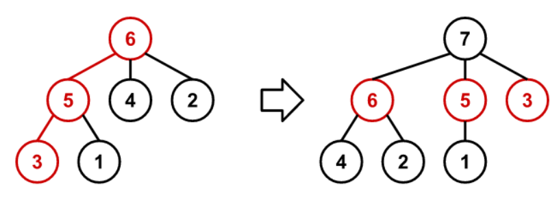
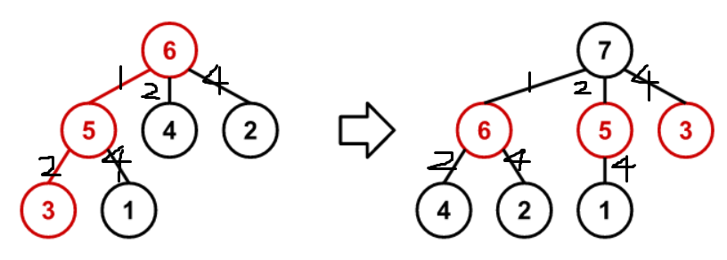

[Problem 872](https://projecteuler.net/problem=872 "Problem 872 - Project Euler")

由序列 $1,2,3,\cdots,n$ 构成了一棵 $n$ 个节点的树 $T_n$。下面是构造这棵树的方法。

开始时，$T_1$ 只有一个节点，即根是 1。

当 $n>1$，根据以下步骤由 $T_{n-1}$ 构造 $T_n$：
1. 从 $T_{n-1}$ 的根开始遍历，每次选择最大的子节点；
2. 断开这条路径上的边，即和父节点脱离；
3. 把这些分离的节点连接到新的节点 $n$ 上，构造出 $T_n$。

下面是从 $T_6$ 构造 $T_7$ 的过程。



函数 $f(n,k)$ 是从 $T_n$ 的根节点 $n$ 沿着某条路径到 $k$ 的所有节点之和。比如 $f(6,1)=6+5+1=12,f(10,3)=29$。

求 $f(10^{17},9^{17})$。

数字非常大，不能遍历。所以我找了找各个节点之间的差值的规律。如下图所示。



假定根节点和下面每个节点的差值是 $1,2,4$，翻倍，再往下一层，如果和父节点的差值是 1，那么和子节点的差值从 2 开始倍增，父节点差值是 2，和子节点差值从 4 开始，也就是说增加一层，差值翻倍，和每个节点与子节点的差值关系是一样的。

手动从 $T_7$ 画到了 $T_{10}$，发现这个规律是成立的。

下面需要知道路径上的每一个节点。

再仔细观察，这些数都是二的若干次幂，然后从上往下越来越大，所以，这个路径上的差是 $n-k$ 的二进制中各个 1 代表的大小。对于写代码而言，这比较容易处理。
```csharp
long root = 100_000_000_000_000_000;
long find = 16677181699666569;     //9^17
long sum = root;
long diff = root - find;

long node = root;
long diff_level = 1;
while (diff != 0)
{
    while (true)
    {
        if (diff % 2 == 1)
        {
            node -= diff_level;
            sum += node;

            diff /= 2;
            diff_level *= 2;

            break;
        }

        diff /= 2;
        diff_level *= 2;
    }
}
```
