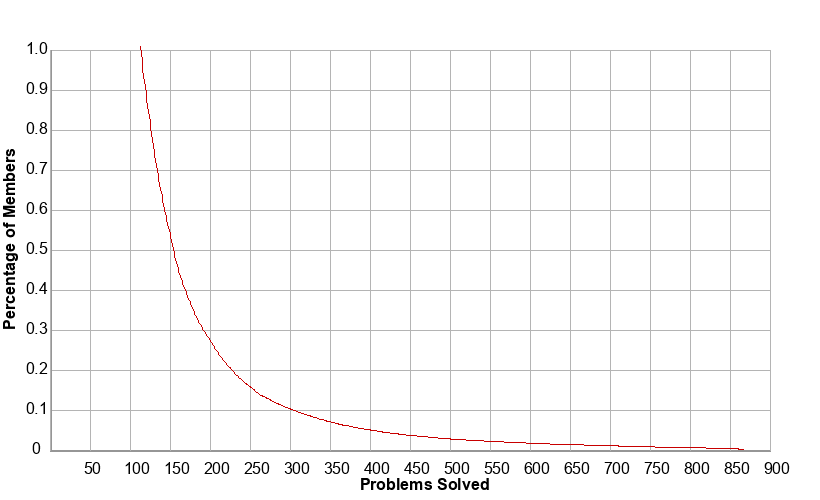

# Project Euler

## What is Project Euler?

Project Euler is a series of challenging mathematical/computer programming problems that will require more than just mathematical insights to solve. Although mathematics will help you arrive at elegant and efficient methods, the use of a computer and programming skills will be required to solve most problems.

The motivation for starting Project Euler, and its continuation, is to provide a platform for the inquiring mind to delve into unfamiliar areas and learn new concepts in a fun and recreational context.

> "Project Euler exists to encourage, challenge, and develop the skills and enjoyment of anyone with an interest in the fascinating world of mathematics."

# 这个文档？
点击右上角前往我解题的 [Github](https://github.com/shenlei149/ProjectEuler) 地址。

这个文档的目的是分析具体的思路和原理。

## 博客迁移计划
之前是在个人[博客](https://guozi149.me/blog/)记录解题思路。现在想法是一点点的迁移过来。目的是
1. 将我这几年攒的东西文档化，方便查找。
2. 把之前的文章和代码过一遍，优化一下。

# 排名
## 2023
2024 年 12 月 15 日，排名有所上升，在前 0.5 %，过去几年平均每年做了 9 个题目。

## 2018
2018 年 5 月 10 日，发现拿到了 One Percenter 的成就，说明进入了所有用户的前百分之一。

