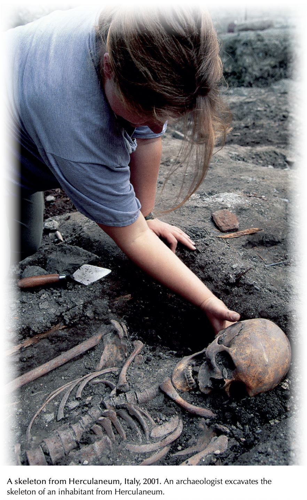
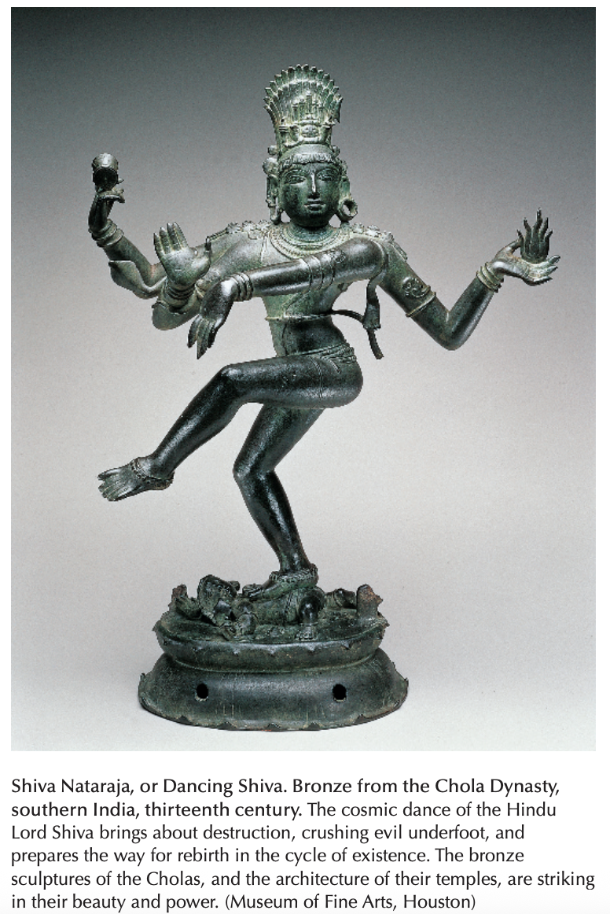
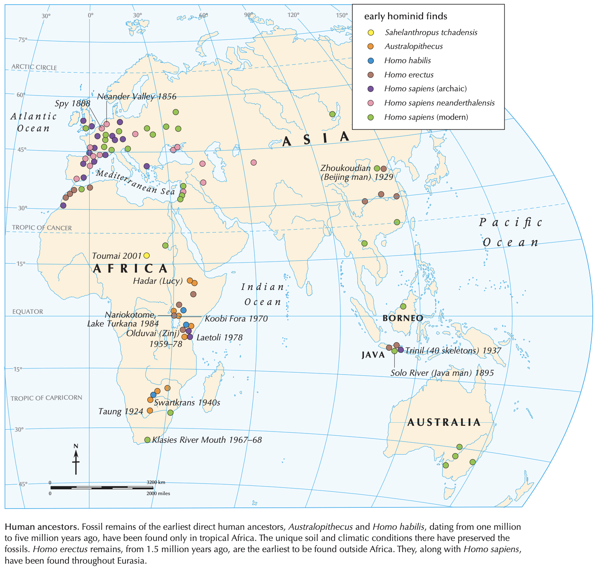
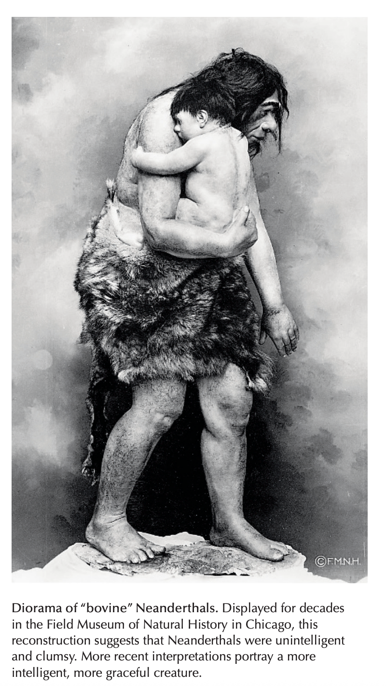
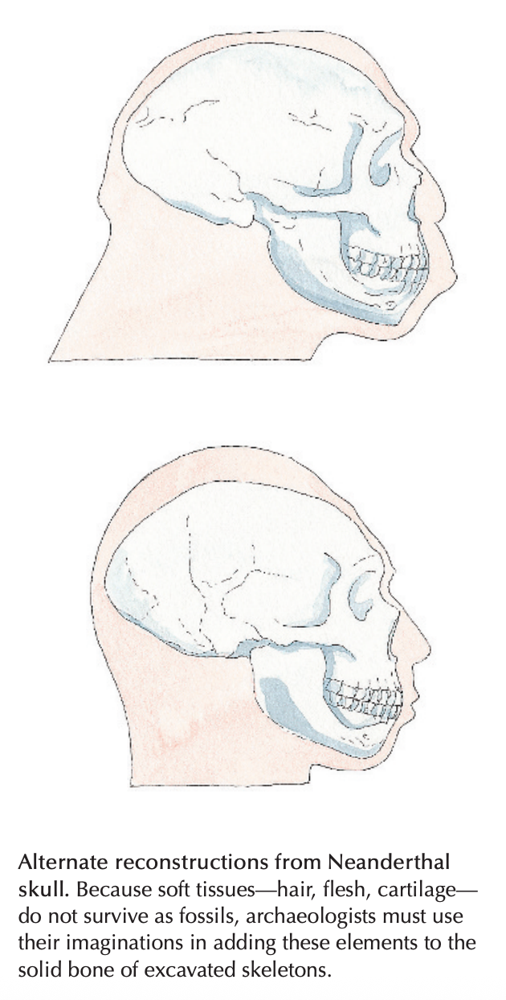
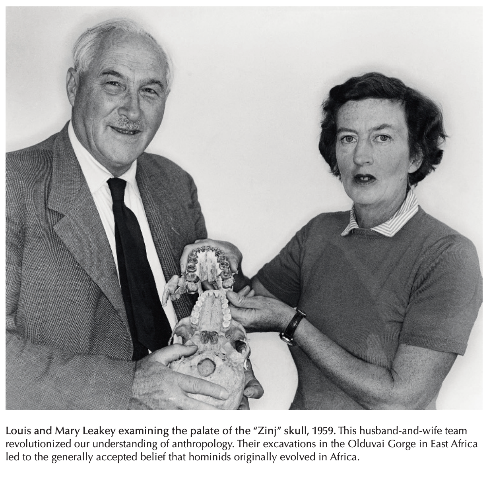

> To 10,000 B.C.E.

The study of the earliest development of humans advances very quickly and often in sudden leaps forward. Because we know so little to begin with, each new discovery has profound impact. Before Darwin, the entire religious and mythological literature of the Judeo-Christian-Islamic world assumed that humans had been created directly by God about 6,000 years ago. (Hindu and Buddhist mythology had a much deeper time frame, but litter interest in exploring the distant past a history.) Darwin's theories, and a continuing array of fossil finds which supports them, propose a vastly longer time frame and a different interpretive framework for understanding human origins and early development. The discovery in 1953 of the structure of the DNA molecule, and our subsequent understanding of its role in determining the nature of each species and each individual, have further enriched our understanding of the evolution of humans. Discoveries of human cultural achievements beginning 35,000 years ago - sophisticated toolkits, cave paintings and small sculptures, long-distance migrations by land and sea - have added to our appreciation of the accomplishments of our ancestors, and of the people who study them so assiduously.

## Human Origins in Myth and History
Where did we come from? How did humans come to inhabit the earth? These questions are difficult to answer because the earliest human beings left no written records or obvious oral traditions. For more than a century, we have sought the answer to these questions in the earth, in the records of the fossils that archaeologists and paleoanthropologists have discovered and interpreted. But before the diggers came with their interpretations, human societies from many parts of the world developed stories based on popular beliefs to explain our origins. Passed from generation to generation as folk wisdom, these stories give meaning to human existence. They not only tell how humans came to inhabit the earth, they also suggest why. Some of these stories, especially those that have been incorporated into religious texts such as the Bible, still inspire the imaginations and govern the behavior of hundreds of millions of people around the world.

* paleoanthropology: the study of the origins and predecessors of the present human species, using fossils and other remains. 古人类学。paleoanthropologist, 古人类学家。

### Early Myth
As professional history developed, many historians dismissed these stories as myths, imaginative constructions that cannot be verified with the kinds of records historians usually use. However, myth and history share a common purpose - trying to explain how the world came to be as it is. Many historians and anthropologists now accept myths as important aids in understanding how different societies have interpreted the origins of the human world. Myths often contain important truths, and they can have powerful effects on people's values and behavior. Shared myths give cohesion to social relationships and provide people with sense of shared community.

* anthropologist: someone who scientifically studies humans and their customs, beliefs, and relationships. 人类学家。

For thousands of years, various creation stories have presented people with explanations of their place in the world and of their relationships to gods, to the rest of creation, and to one another. The narratives have similarities, but also significant differences. Some portray humans as the exalted crown of creation, others as reconfigured parasites; some depict humans as partners with the gods, others as their servants; some suggest the equality of all humans, others stress a variety of caste, race, and gender hierarchies. To some degree, surely, people transmit the stories as quaint tales told for enjoyment only, but they also provide guidance on how people should understand and live their lives.

* exalted: An exalted position in an organization is a very important one. 重要的（地位）。
* caste: A hierarchical ordering of people into groups, fixed from birth, based on their inherited ritual status and determining whom they may marry and with whom they may eat. 社会等级。

One of the earliest known stories is the Enuma Elish epic of the people of Akkad in Mesopotamia. This account probably dates back to almost 2000 B.C.E. It tells of wars among the gods. Tiamat mates with Apsu and gives birth to younger gods. Later the parents seek to kill off his new generation of their children-gods. To save the god-children, the god Ea slays Apsu while Ea's son Marduk rallies the younger gods, and kills and dismember Tiamat and her new husband, Kingu. From the blood of Kingu, Marduk creates humans (and all of earth's creatures), on condition that they are to be his servants. Written at a time when the competitive city-states Mesopotamia were constantly at war, this myth elevated the importance of Babylon, the city that Marduk chooses as his capital; affirmed the authority of its powerful priests and rulers; and assigned purpose and direction to human life.

* Enuma Elish: 埃努玛·埃利什，古巴比伦的创世史诗。
* Akkad: a city on the Euphrates in N Babylonia, the centre of a major empire and civilization (2360–2180 bc). 古巴比伦阿卡德区。
* Euphrates: a long river in western Asia that was one of the two great rivers of the ancient region of Mesopotamia. 幼发拉底河。
* Tiamat: an Akkadian goddess, the consort of Apsu and mother of the gods. 提亚玛特（又叫混沌母神，源于巴比伦神话，世界开创时即存在怪物）。
* Apsu: an Akkadian god: the consort of Tiamat and the father of the gods. 阿卜苏（美索不达米亚神话中的原始甜水之渊及其人格化形式）。
* Marduk: the chief god of the Babylonian pantheon. 马杜克（古巴比伦人的主神）。
* pantheon: a small group of people or things that are considered to be the most important ones of their type.（某一领域的）名流，名人，要人。万神殿；名流群。
* Ea: Enki, Marduk is the son of Ea (Enki). Ea and Marduk are both major figures in Mesopotamian mythology, but they represent distinct roles.
* slay: to kill in a violent way.（以暴力）杀死；残杀。
* dismember: to cut, tear, or pull the arms and legs off the body of a dead person or animal. 肢解，分割……的肢体。

India, vast and diverse, has many different stories about the origin of humans. Two of the most widespread and powerful illustrate two principal dimensions of the thought and practice of Hindu religious traditions. The ancient epic Rigveda, which dates from about 1000 B.C.E., emphasizes the mystical, unknowable qualities of life and its origins:

Why verily knows and who can here declare it, whence it was born and whence comes this creation?

The Gods are later than this world's production. Who knows then whence it first came into being?

He, the first origin of this creation, whether he formed it all or did not from it, whose eye controls this world in highest heaven, he verily knows it or perhaps he knows not.

* Hindu: someone who believes in Hinduism. 印度教教徒。
* Rigveda: a compilation of 1028 Hindu poems dating from 2000 bc or earlier. 梨俱吠陀，吠陀经中最早出现的一卷。
* whence: (from) where. 从那里。

In contrast to this reverent puzzled view of creation, another of the most famous hymns of the Rigveda, the Purusha-sakta, describes the creation of the world by the god's sacrifice and dismemberment of a giant man, Purusha:

His mouth became the Brahmin; his arms were made into the Warrior; his thighs the People; and from his feet the Servants were born.

The moon was born from his mind; from his eye the sun was born. Indra and Agni came from his mouth, and from vital breath the Wind was born.

* hymn: a song of praise that Christians sing to God. 赞美诗，圣歌。
* reverent: showing great respect and admiration. 肃然起敬。
* Purusha-sakta: 原人歌，梨俱吠陀中的一首诗。
* the Brahmin, the Warrior, the People, the Servant: The terms "Brahmin, Warrior, People, Servant" refer to the four traditional varnas (social classes) in the Hindu caste system, namely Brahmins (priests and scholars), Kshatriyas (kings, governors, and warriors), Vaishyas (cattle herders, agriculturists, artisans, and merchants), and Shudras (laborers and service providers). These varnas represent a hierarchical structure with Brahmins at the top and Shudras at the bottom. 婆罗门（祭司和学者）、刹帝利（国王、统治者和武士）、吠舍（牧民、农民、工匠和商人）和首陀罗（劳工和服务提供者）。
* Indra, Agni, Wind: 印度神。因陀罗（古印度神话中印度教的主神，主管雷雨）；阿格尼（印度神话中的火神）；掌管风的神。

In this account, humans are part of nature, subject to the law of the universe, but they are not born equal among themselves. Several groups are created with different qualities and in different castes. This myth of creation supports the hierarchical organization of India's historic caste system.

Perhaps the most widely known creation story is told in the Book of Genesis in the Hebrew Bible. Beginning from nothing, in five days God created heaven and earth; created the light and separated it from darkness; created water and separated it from dry land; and created flora, birds, and fishes, and the sun, moon, and stars. God began the six day by creating larger land animals and reptiles, and then humans "in his own image".

* Book of Genesis: 创世纪。
* Hebrew Bible: 希伯来圣经。
* flora: all the plants of a particular place or from a particular time in history.（某一地点或时期的）植物群。
* reptile: an animal that produces eggs and uses the heat of the sun to keep its blood warm. 爬行动物。

The Book of Genesis assigns humans a unique and privileged place as the final crown and master of creation. Humans are specially created in God's own image, with dominion over all other living creatures. When the creation of humans is complete and their exalted position in nature is specified, God proclaims the whole process and product of creation as "good". Here humans hold an exalted position within, but also above, the rest of creation.

* dominion: control over a country or people. 控制；统治；支配。
* exalted: An exalted position in an organization is a very important one. 重要的（地位）。

Until the late eighteen century, these kinds of story were the only accounts we had of the origins of humans. No other explanations seemed necessary. In any case, no one expected to find actual physical evidence for the processes by which humans came to exist.

### The Evolutionary Explanation
During the eighteen century, some philosophers and natural scientists in Europe, who were most familiar with the creation story told in the Bible, began to challenge its belief in the individual, special creation of each life form. They saw so many similarities among different species that they could not believe that each had been created separately, although they could not demonstrate the processes through which these similarities and differences had developed. They saw some creatures change forms during their life cycle, such as the metamorphosis of the caterpillar into the moth, or the tadpole into the frog, but they could not establish the processes by which one species metamorphosed into another. They also knew the processes of breeding by which farmers encouraged the development of particular strains in farm animals and plants, but they lacked the conception of a time frame of millions of years that would allow for the natural evolution of a new species from an existing one.

* metamorphosis: a complete change. 彻底的变化。
* tadpole: a small, black creature with a large head and long tail that lives in water and develops into a frog or toad. 蝌蚪。
* toad: a small, brown animal, similar to a frog, that has big eyes and long back legs for swimming and jumping. 蟾蜍，癞蛤蟆。
* breeding: the keeping of animals or plants in order to breed from them.（动物的）繁殖，饲养;（植物的）培植。

Challenging the authority of the biblical account required a new method of inquiry, a new system for organizing knowledge. By the mid-eighteen century, a new intellectual environment had began to emerge. Scientific method called for the direct observation of nature, the recording and analysis of observation, and the discussion and debate of findings throughout an international community of scholars. It rejected the authority of religious texts that asserted truths without presenting substantiating evidence.

Charles Darwin (1809-1882) and Alfred Russel Wallace (1823-1913), separately, formulated the modern theory of the biological evolution of species. They saw the mounting evidence of biological similarities among related to one another, not separate creations; and they allowed a time frame adequate for major transformations of species to take place. They then went on to demonstrate the method by which small differences within a species were transmitted from generation to generation, increasing the differentiation until new forms were produced.

Both Darwin and Wallace reached their conclusions as a result of extensive travel overseas. Darwin carried out his observations on a scientific voyage around the world in 1981-1836 aboard the British warship Beagle, and especially during his stay in the Galapagos Islands off the equatorial west coast of South America. Wallace traveled for many years in the islands of Southeast Asia. In 1855 he published a paper suggesting a common ancestor for primates and man. In 1885 Wallace and Darwin published a joint paper on the basic concepts of evolution.

* primate: a member of the most developed and intelligent group of mammals, including humans, monkeys, and apes. 灵长类动物。

In the isolated Galapagos Islands, Darwin had found various kinds of finches, all of which were similar to each other except in their beaks. He rejected the idea that each kind of finch had been separately created. Rather, he argued, there must have been an ancestor common to them all throughout the islands. Because each island offered slightly different food sources, different beaks were better suited to different islands. The different ecological niches on each separate island to which the birds had immigrated had evoked slightly different evolutionary development. From a single, common ancestor, new species had evolved over time on the different islands.

* finch: any of various types of small singing bird with a short, wide, pointed beak. 雀科鸣鸟。
* niche: an area or position that is exactly suitable for a small group of the same type. 合宜的小环境。

Darwin compared natural selection to the selection process practiced by humans in breeding animals. Farmers know that specific traits among their animals can be exaggerated through breedings. Horse, for example, can be bred either for speed or for power by selecting those horses in which the desired trait appears. In nature the act of selection occurs spontaneously, if more slowly, as plants and animals with traits that are more appropriate to an environment survive and reproduce while others do not.

In 1859 Darwin published his findings and conclusions in On the Origin of Species by Means of Natural Selection, a book that challenged humankind's conception of life on earth and of our place in the universe. Darwin explained that the pressure for each organism to compete, survive, and reproduce created a kind of natural selection. The population of each species increased until its ecological niche was filled to capacity, In the face of this population pressure, the species that were better adapted to the niche survived; the rest were crowed out and tended toward extinction. Small differences always appeared within a species: some members were taller, some shorter; some more brightly colored, others less radiant; some with more flexible hands and feet, others less manipulable. Those members with differences that aided survival in any given ecological setting tended to live on and to transmit their differences to their descendants. Others died out. Darwin call this process "natural selection" or "survival of the fittest".

* radiant: obviously very happy, or very beautiful. 喜气洋洋的；容光焕发的；光彩照人的。

Darwin's argument challenged two prevailing stories of creation, especially the biblical views. First, the process of natural selection had no goal beyond survival and reproduction. Unlike many existing creation myths, especially biblical stories, evolutionary theory postulated no teleology, no ethical or moral goals and purposes of life. Second, the theory of natural selection described the evolution of ever more "fit" organisms, better adapted to their environment, evolving from existing ones. The special, separate creation of each species was not necessary.

* teleology: (in philosophy) the belief that everything has a special purpose or use. 目的论（认为一切事物均为特定目的而安排）。
* ethical: relating to beliefs about what is morally right and wrong. 道德的；伦理的。

For Darwin, the process of natural selection of more complex, better adapted forms also explained the evolution of humans from simpler, less-adapter organisms. Perhaps this was "the Creator's" method. Darwin concluded On the Origin of Species:

Thus, from the war of nature, from famine and death, the most exalted object which we are capable of conceiving, namely, the production of the higher animals, directly follows. There is grandeur in this view of life, with its several powers, having been originally breathed by the Creator into a few forms or into one; and that, whilst this planet has gone cycling on according to the fixed law of gravity, from so simple a beginning endless forms most beautiful and wonderful have been, and are being, evolved.

* grandeur: the quality of being very large and special or beautiful. 宏伟，壮丽，堂皇。

Note, however, that the words "by the Creator" did not appear in the first edition. Darwin added them later, perhaps in response to criticisms raised by more conventional Christian religious thinkers, who continued to find the biblical story a credible explanation for the origins of human beings.

With a decade, Darwin's ideas had won over the scientific community. In 1871, in The Decent of Man, Darwin extended his argument to the evolution of humans, concluding explicitly that "man is descended from some lowly organized form." Humans are a part of the order of primates, most closely related to great apes and chimpanzees.

The search now began for evidence of the "missing link" between humans and apes, for some creature, living or extinct, that stood at an intermediate point in the evolutionary process. In this search archaeology, and the adjunct field of paleoanthropology, flourished.

## Fossils and fossil-hunters
The search for the "missing link" began in Europe, because that is where the major scientific lived and worked. Later, the search led to Java, Indonesia, and Beijing, China. Still more recently, Africa has yielded the earliest specimens of the human species, fulfilling Darwin's prediction of an African origin of human evolution, based on the abundance of nonhuman primates - apes and chimpanzees - living on that continent.

As archaeologists discovered a variety of kinds of **hominid** - creatures that exhibited some characteristics of humans as well as of earlier primates - they concluded that there was no single missing link, but rather a variety of evolutionary paths that led to the emergence of humans.

* hominid: a member of a group that consists of humans, chimpanzees, gorillas, and orang-utangs, or an early form of one of these. 人类及其祖先，人科。

### The puzzling Neanderthals
In August 1856, workers quarrying for limestone in a cave in the Neander Valley near Dusseldorf, Germany, found a thick skullcap with a sloping forehead and several skeletal bones of limbs. Some speculated that it was a deformed human. Others thought it was a soldier lost in a previous war. Similar skeletal remains had been found before, but without any clearer understanding of their meaning.

* quarry: a large artificial hole in the ground where stone, sand, etc. is dug for use as building material. 采石场。

In 1863, Thomas Henry Huxley (1828 - 1895), a leading advocate of Darwin's theory of evolution, argued that the skull was part of a primitive human being who stood between nonhuman primates and **Homo sapiens**, our own species. He claimed that it was the "missing link". In 1864, scholars gave the fossil a name that signified this intermediate position: Homo neanderthalensis.

* Homo sapiens: modern humans considered together as a species. 人类；智人。

One of the first questions archaeologists asked themselves was: What did Homo neanderthalensis look like? Reconstructing the appearance of Neanderthals was difficult, because soft tissue - hair, flesh, and cartilage - does not survive as fossils. Scientists had to use their imaginations.

* cartilage: (a piece of) a type of strong tissue found in humans in the joints (= places where two bones are connected) and other places such as the nose, throat, and ears. 软骨（组织）。

The earliest efforts to reconstruct the appearance of Neanderthals showed them waling like apes, with a spine that had no curves, and hunchbacked, with their heads pushed forward on top of their spines. Showing muscular but clumsy-looking creatures, with heavy jaws and low, sloping foreheads, these pictures strongly suggested that Homo neanderthalensis was brutish and lacking in intelligence. For many years this interpretation, and others similar to it, carried great weight. Museum representations carried the message to the general public. Over the years, however, archaeologists have discovered more about Neanderthals' ability to make tools and survive in challenging environments. Impressed with these accomplishments, anthropologists now create reconstructions that show Neanderthals looking much less "primitive" and more like modern humans.

* hunchbacked: having or appearing to have a large, round raised area on your back, often because of illness or old age. 驼背的。
* brutish: rough, unpleasant, and often violent. 野蛮的。
* carried great weight: 具有重要影响。

Moving beyond the individual skeleton in isolation, teams of experts from such disciplines as biology, geology, and climatology cooperate to reconstruct the natural settings of human and hominid development. As Neanderthal skeletons have been found from northern Europe to Africa, from Gibraltar to Iran, these natural settings vary greatly. Remains from caves near Gibraltar suggest that Neanderthals in that area lived in a nuclear family. Elsewhere, evidence shows that many Neanderthals lived in large bands of up to 20 to 30 individuals.

One recent discovery suggests that at least some Neanderthals were cannibals. The evidence comes from a cave in southern France. A total of 78 bones from at least two adults, two teenagers, and two children aged about seven show that the flesh from all parts of the bodies was carefully removed. Bones were smashed with rocks to get at the inside marrow, and skulls were broken open. The Neanderthals bones and the bones of deer were tossed together into a heap and show similar marks from the same stone tools. On the other hand, there are many other examples of Neanderthals burying their dead carefully, suggesting that their cultural behavior differed from group to group.

* cannibal: a person who eats human flesh, or an animal that eats the flesh of animals of its own type. 食人肉者；同类相食的动物。
* marrow: soft tissue containing a lot of fat in the centre of a bone. 髓，骨髓。

### Homo erectus: A Worldwide Wanderer
The next of these prehistoric hominid species to be unearthed - the most widespread, and the closest to modern humans - was Homo erectus ("upright human"). Examples of this species were discovered in widely dispersed locations throughout the eastern hemisphere and first named according to the locations in which they were found. Later anthropologists recognized the similarities among them, named them collectively Homo erectus, and traced their migration patterns from their earliest home in Africa to new habitats across Asia.

In 1891, Eugene Dubois (1858-1940), a surgeon in the Dutch army in Java, Indonesia, was exploring for fossils. Employing the labor of convicts in Dutch prisons, along the bank of the Solo River, he discovered a cranium with a brain capacity of 900cc (compared to the modern human average of 1,400cc), a molar, and a femur. Dubois claimed to have discovered Pithecanthropus erectus, or ape-man. This find , widely referred to as Java Man, as the first early hominid discovered outside Europe. Dubois's Java Man forced scholars to consider the theories of the evolution of humans more seriously and to understand the process in a global context.

* cranium: the hard bone case that gives an animal's or a human's head its shape and protects the brain. 颅，头颅；头盖骨。
* molar: one of the large teeth at the back of the mouth in humans and some other animals used for crushing and chewing food. 臼齿，磨牙。
* femur: the long bone in the upper part of the leg. 股骨。

In 1929, in the vast Zhoukoudian cave, 30 miles from Beijing, Chinese archaeologists discovered a 500,000-year-old skullcap. In the next few years, in this fossil-rich cave, the discovered 14 omre fossil skulls and the remains of some 40 individuals, whom they dated to 600,000 to 200,000 years ago. The cave seems to have been the home of a band of hunters, who lived in a forested, grassy, riverine area and who ate plants as well as animals, such as bison and deer. Remaining bones and ash indicate their ability to use fire for light and cooking. With a brain capacity ranging from 775 to 1,300cc and a height up to 5 feet 6 inches, anatomically Beijing Man was almost identical to Java Man. About a decade later, further excavation in Java turned up the nearly complete skull of one hominid and the skeletons of some 40 others who had lived 100,000 to 900,000 years ago. Anthropologists soon recognized similarities between Java Man and Beijing Man, and classified them collectively under the name Homo erectus. The 40 skeletons from Java represent one-third of all the Homo erectus skeletons uncovered to this day in the entire world. Those in the Zhoukoudian cave represent another third. The most complete skeleton we have of Homo erectus was discovered, however, in Africa, in 1984, on the shores of Lake Turkana, Kenya.

* riverine: relating to or found on a river or rivers, or the banks of a river. 河流的；河上的；在河岸的。
* anatomically: related to the human body and how its parts are arranged. 解剖学地，身体比例上地。
* excavation: the act of removing earth that is covering very old objects buried in the ground in order to discover things about the past.（古物的）发掘。

### The Search Shifts to Africa
In 1924, a medical student in South Africa called the attention of his professor, Raymond Dart, to some fossils in a quarry near Taung. Dart investigated and proclaimed the Taung skull to be Australopithecus africanus, "southern apelike creature of Africa", a two-million-year-old ancestor of humans. Another medical doctor, Robert Broom, discovered additional hominid fossils, including some of Home erectus, similar to those discovered in Java and China. Between 1945 and 1955, Dart and his colleagues began to discover bone tools among the fossils, as well as evidence of the first controlled use of fire, about a million years ago. Their research extended beyond the archaeology of individual hominid skeletons to paleoanthropology. Their ecological analyses included, for example, the fossils of hundreds of animals discovered near the hominids.

* australopithecus: a creature living in Africa millions of years ago, that could walk on two feet and that had characteristics of both apes and human beings. 南方古猿（数百万年前生活在非洲，可以用双脚行走，有类人猿和人类的特征）。

Archaeologist Louis Leakeys (1903-1972) begin his excavations in Eat Africa in the 1930s, although his most important discoveries were achieved with his wife, Mary (1913-1996), after 1959 in the Olduvai Gorge, where the Great Rift Valley cuts through northern Tanzania.

* rift: a large crack in the ground or in rock.（地面或岩石上的）裂缝，裂口。

The Great Rift Valley runs from the Jordan River valley and the Dead Sea southward through the Red Sea, Ethiopia, Tanzania, and Mozambique. The Rift is a fossil-hunter's delight. From at least seven million years ago until perhaps 100,000 years ago, it was a fertile, populated region; it is geologically still shifting and, therefore, has covered and uncovered its deposits over time. Rivers that run through the Rift Valley further the process of uncovering the fossils, and it is volcanic, generating lava and ash that preserve the fossils caught within it and provide the material for relatively accurate dating.

* lava: hot liquid rock that comes out of the earth through a volcano, or the solid rock formed when it cools.（火山喷出的）岩浆，熔岩；火山岩。

At Olduvai in 1959, the Leakeys discovered a hominid they call Zinjanthropus boisei, soon nicknamed "Zinj". At first they hoped that Zinj might be an early specimen of Homo, but its skull was too small, its teeth were too large, its arms were too long, and its face was too much like an ape's. Zinj, who was 1,750,000 years old, was another Australopithecus, a hominid closer to apes than to modern humans. The Australopithecus clan was thus extended to include a new cousin, Australopithecus boisei. The australopithecine family tree - or "bush" by now showed a number of branches, although the relationship among them and to us is not always clear.

#### Homo habilis
The Leakeys' continued excavations at Olduvai turned up skull fragments of creatures with brain capacities of 650cc, between the 400-500 cc of australopithecines and the 1,400 cc of modern humans. The Leakeys named this new type of hominid Homo habilis, "handy person", because of the stone tools they made and used in scavenging, hunting, and butchering food. Dating suggested that Homo habilis lived at about the same time as Zinj, demonstrating that Homo and Australopithecus had lived side by side about two million years ago.

* scavenge: to look for or get food or other objects in other people's rubbish.（从废弃物中）觅食；捡破烂。

The Leakeys' discoveries at Olduvai furthered the search for ancestors of modern humans in several directions: they pushed back the date of the earliest known representative of the genus Homo to 1.5-2 million years ago; they indicated the extent of the tool-using capacity of these early Homo representatives; and they reconstructed the ecology of the region 2.5-1.5 million years ago, placing Homo habilis within it as hunter and scavenger. Together with earlier discoveries, the findings enabled the Leakeys to identify Africa as the home of the earliest hominids and the earliest representatives of the genus Homo.

* genus: a group of animals or plants, more closely related than a family, but less similar than a species.（动植物的）属。

In the 1970s, Louis and Mary's son, Richard Leakey (b. 1944), discovered additional bones of the species Homo habilis at Koobi Fora on the east side of Lake Turkana in Kenya. The finds confirmed the size of its brain at about 650 cc; its opposable thumb, which allowed it to grip objects powerfully and manipulate them precisely, and thus to make tools; and its upright, bipedal (two-legged) walk, evident from the form of its hip and leg bones.

#### Australopithecus afarensis
4 weeks
