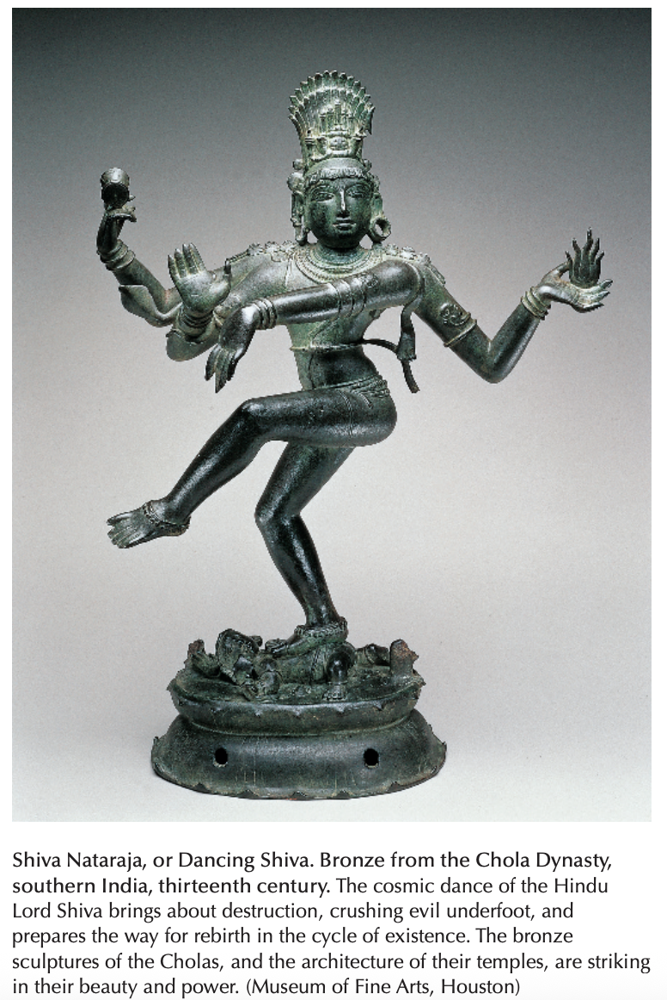

> To 10,000 B.C.E.

The study of the earliest development of humans advances very quickly and often in sudden leaps forward. Because we know so little to begin with, each new discovery has profound impact. Before Darwin, the entire religious and mythological literature of the Judeo-Christian-Islamic world assumed that humans had been created directly by God about 6,000 years ago. (Hindu and Buddhist mythology had a much deeper time frame, but litter interest in exploring the distant past a history.) Darwin's theories, and a continuing array of fossil finds which supports them, propose a vastly longer time frame and a different interpretive framework for understanding human origins and early development. The discovery in 1953 of the structure of the DNA molecule, and our subsequent understanding of its role in determining the nature of each species and each individual, have further enriched our understanding of the evolution of humans. Discoveries of human cultural achievements beginning 35,000 years ago - sophisticated toolkits, cave paintings and small sculptures, long-distance migrations by land and sea - have added to our appreciation of the accomplishments of our ancestors, and of the people who study them so assiduously.

## Human Origins in Myth and History
Where did we come from? How did humans come to inhabit the earth? These questions are difficult to answer because the earliest human beings left no written records or obvious oral traditions. For more than a century, we have sought the answer to these questions in the earth, in the records of the fossils that archaeologists and paleoanthropologists have discovered and interpreted. But before the diggers came with their interpretations, human societies from many parts of the world developed stories based on popular beliefs to explain our origins. Passed from generation to generation as folk wisdom, these stories give meaning to human existence. They not only tell how humans came to inhabit the earth, they also suggest why. Some of these stories, especially those that have been incorporated into religious texts such as the Bible, still inspire the imaginations and govern the behavior of hundreds of millions of people around the world.

* paleoanthropology: the study of the origins and predecessors of the present human species, using fossils and other remains. 古人类学。paleoanthropologist, 古人类学家。

### Early Myth
As professional history developed, many historians dismissed these stories as myths, imaginative constructions that cannot be verified with the kinds of records historians usually use. However, myth and history share a common purpose - trying to explain how the world came to be as it is. Many historians and anthropologists now accept myths as important aids in understanding how different societies have interpreted the origins of the human world. Myths often contain important truths, and they can have powerful effects on people's values and behavior. Shared myths give cohesion to social relationships and provide people with sense of shared community.

* anthropologist: someone who scientifically studies humans and their customs, beliefs, and relationships. 人类学家。

For thousands of years, various creation stories have presented people with explanations of their place in the world and of their relationships to gods, to the rest of creation, and to one another. The narratives have similarities, but also significant differences. Some portray humans as the exalted crown of creation, others as reconfigured parasites; some depict humans as partners with the gods, others as their servants; some suggest the equality of all humans, others stress a variety of caste, race, and gender hierarchies. To some degree, surely, people transmit the stories as quaint tales told for enjoyment only, but they also provide guidance on how people should understand and live their lives.

* exalted: An exalted position in an organization is a very important one. 重要的（地位）。
* caste: A hierarchical ordering of people into groups, fixed from birth, based on their inherited ritual status and determining whom they may marry and with whom they may eat. 社会等级。

One of the earliest known stories is the Enuma Elish epic of the people of Akkad in Mesopotamia. This account probably dates back to almost 2000 B.C.E. It tells of wars among the gods. Tiamat mates with Apsu and gives birth to younger gods. Later the parents seek to kill off his new generation of their children-gods. To save the god-children, the god Ea slays Apsu while Ea's son Marduk rallies the younger gods, and kills and dismember Tiamat and her new husband, Kingu. From the blood of Kingu, Marduk creates humans (and all of earth's creatures), on condition that they are to be his servants. Written at a time when the competitive city-states Mesopotamia were constantly at war, this myth elevated the importance of Babylon, the city that Marduk chooses as his capital; affirmed the authority of its powerful priests and rulers; and assigned purpose and direction to human life.

* Enuma Elish: 埃努玛·埃利什，古巴比伦的创世史诗。
* Akkad: a city on the Euphrates in N Babylonia, the centre of a major empire and civilization (2360–2180 bc). 古巴比伦阿卡德区。
* Euphrates: a long river in western Asia that was one of the two great rivers of the ancient region of Mesopotamia. 幼发拉底河。
* Tiamat: an Akkadian goddess, the consort of Apsu and mother of the gods. 提亚玛特（又叫混沌母神，源于巴比伦神话，世界开创时即存在怪物）。
* Apsu: an Akkadian god: the consort of Tiamat and the father of the gods. 阿卜苏（美索不达米亚神话中的原始甜水之渊及其人格化形式）。
* Marduk: the chief god of the Babylonian pantheon. 马杜克（古巴比伦人的主神）。
* pantheon: a small group of people or things that are considered to be the most important ones of their type.（某一领域的）名流，名人，要人。万神殿；名流群。
* Ea: Enki, Marduk is the son of Ea (Enki). Ea and Marduk are both major figures in Mesopotamian mythology, but they represent distinct roles.
* slay: to kill in a violent way.（以暴力）杀死；残杀。
* dismember: to cut, tear, or pull the arms and legs off the body of a dead person or animal. 肢解，分割……的肢体。

India, vast and diverse, has many different stories about the origin of humans. Two of the most widespread and powerful illustrate two principal dimensions of the thought and practice of Hindu religious traditions. The ancient epic Rigveda, which dates from about 1000 B.C.E., emphasizes the mystical, unknowable qualities of life and its origins:

Why verily knows and who can here declare it, whence it was born and whence comes this creation?

The Gods are later than this world's production. Who knows then whence it first came into being?

He, the first origin of this creation, whether he formed it all or did not from it, whose eye controls this world in highest heaven, he verily knows it or perhaps he knows not.

* Hindu: someone who believes in Hinduism. 印度教教徒。
* Rigveda: a compilation of 1028 Hindu poems dating from 2000 bc or earlier. 梨俱吠陀，吠陀经中最早出现的一卷。
* whence: (from) where. 从那里。

In contrast to this reverent puzzled view of creation, another of the most famous hymns of the Rigveda, the Purusha-sakta, describes the creation of the world by the god's sacrifice and dismemberment of a giant man, Purusha:

His mouth became the Brahmin; his arms were made into the Warrior; his thighs the People; and from his feet the Servants were born.

The moon was born from his mind; from his eye the sun was born. Indra and Agni came from his mouth, and from vital breath the Wind was born.

* hymn: a song of praise that Christians sing to God. 赞美诗，圣歌。
* reverent: showing great respect and admiration. 肃然起敬。
* Purusha-sakta: 原人歌，梨俱吠陀中的一首诗。
* the Brahmin, the Warrior, the People, the Servant: The terms "Brahmin, Warrior, People, Servant" refer to the four traditional varnas (social classes) in the Hindu caste system, namely Brahmins (priests and scholars), Kshatriyas (kings, governors, and warriors), Vaishyas (cattle herders, agriculturists, artisans, and merchants), and Shudras (laborers and service providers). These varnas represent a hierarchical structure with Brahmins at the top and Shudras at the bottom. 婆罗门（祭司和学者）、刹帝利（国王、统治者和武士）、吠舍（牧民、农民、工匠和商人）和首陀罗（劳工和服务提供者）。
* Indra, Agni, Wind: 印度神。因陀罗（古印度神话中印度教的主神，主管雷雨）；阿格尼（印度神话中的火神）；掌管风的神。

In this account, humans are part of nature, subject to the law of the universe, but they are not born equal among themselves. Several groups are created with different qualities and in different castes. This myth of creation supports the hierarchical organization of India's historic caste system.

Perhaps the most widely known creation story is told in the Book of Genesis in the Hebrew Bible. Beginning from nothing, in five days God created heaven and earth; created the light and separated it from darkness; created water and separated it from dry land; and created flora, birds, and fishes, and the sun, moon, and stars. God began the six day by creating larger land animals and reptiles, and then humans "in his own image".

* Book of Genesis: 创世纪。
* Hebrew Bible: 希伯来圣经。
* flora: all the plants of a particular place or from a particular time in history.（某一地点或时期的）植物群。
* reptile: an animal that produces eggs and uses the heat of the sun to keep its blood warm. 爬行动物。

The Book of Genesis assigns humans a unique and privileged place as the final crown and master of creation. Humans are specially created in God's own image, with dominion over all other living creatures. When the creation of humans is complete and their exalted position in nature is specified, God proclaims the whole process and product of creation as "good". Here humans hold an exalted position within, but also above, the rest of creation.

* dominion: control over a country or people. 控制；统治；支配。
* exalted: An exalted position in an organization is a very important one. 重要的（地位）。

Until the late eighteen century, these kinds of story were the only accounts we had of the origins of humans. No other explanations seemed necessary. In any case, no one expected to find actual physical evidence for the processes by which humans came to exist.

### The Evolutionary Explanation
During the eighteen century, some philosophers and natural scientists in Europe, who were most familiar with the creation story told in the Bible, began to challenge its belief in the individual, special creation of each life form. They saw so many similarities among different species that they could not believe that each had been created separately, although they could not demonstrate the processes through which these similarities and differences had developed. They saw some creatures change forms during their life cycle, such as the metamorphosis of the caterpillar into the moth, or the tadpole into the frog, but they could not establish the processes by which one species metamorphosed into another. They also knew the processes of breeding by which farmers encouraged the development of particular strains in farm animals and plants, but they lacked the conception of a time frame of millions of years that would allow for the natural evolution of a new species from an existing one.

* metamorphosis: a complete change. 彻底的变化。
* tadpole: a small, black creature with a large head and long tail that lives in water and develops into a frog or toad. 蝌蚪。
* toad: a small, brown animal, similar to a frog, that has big eyes and long back legs for swimming and jumping. 蟾蜍，癞蛤蟆。
* breeding: the keeping of animals or plants in order to breed from them.（动物的）繁殖，饲养;（植物的）培植。

Challenging the authority of the biblical account required a new method of inquiry, a new system for organizing knowledge. By the mid-eighteen century, a new intellectual environment had began to emerge. Scientific method called for the direct observation of nature, the recording and analysis of observation, and the discussion and debate of findings throughout an international community of scholars. It rejected the authority of religious texts that asserted truths without presenting substantiating evidence.

Charles Darwin (1809-1882) and Alfred Russel Wallace (1823-1913), separately, formulated the modern theory of the biological evolution of species. They saw the mounting evidence of biological similarities among related to one another, not separate creations; and they allowed a time frame adequate for major transformations of species to take place. They then went on to demonstrate the method by which small differences within a species were transmitted from generation to generation, increasing the differentiation until new forms were produced.

Both Darwin and Wallace reached their conclusions as a result of extensive travel overseas. Darwin carried out his observations on a scientific voyage around the world in 1981-1836 aboard the British warship Beagle, and especially during his stay in the Galapagos Islands off the equatorial west coast of South America. Wallace traveled for many years in the islands of Southeast Asia. In 1855 he published a paper suggesting a common ancestor for primates and man. In 1885 Wallace and Darwin published a joint paper on the basic concepts of evolution.

* primate: a member of the most developed and intelligent group of mammals, including humans, monkeys, and apes. 灵长类动物。

In the isolated Galapagos Islands, Darwin had found various kinds of finches, all of which were similar to each other except in their beaks. He rejected the idea that each kind of finch had been separately created. Rather, he argued, there must have been an ancestor common to them all throughout the islands. Because each island offered slightly different food sources, different beaks were better suited to different islands. The different ecological niches on each separate island to which the birds had immigrated had evoked slightly different evolutionary development. From a single, common ancestor, new species had evolved over time on the different islands.

* finch: any of various types of small singing bird with a short, wide, pointed beak. 雀科鸣鸟。
* niche: an area or position that is exactly suitable for a small group of the same type. 合宜的小环境。
