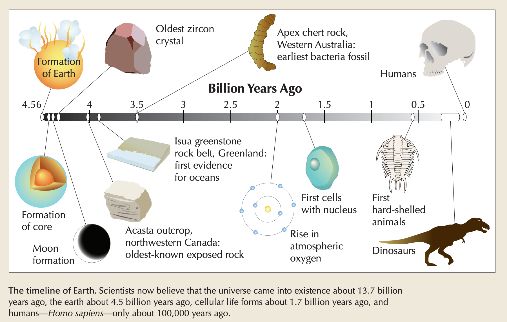

# TURNING POINT: HUMAN ORIGINS
> To 10,000 B.C.E.

## humankind Begins
Historians ask some very big questions. Of course, the stereotype of the historian as a person who searches in dusty archives for tiny, concrete bits of data is often correct. Detail and accuracy are important. Beneath this search for details, however, lie profound questions of fundamental importance. In this chapter we address some of the biggest questions of all: Where did humans come from? How did our collective life on earth begin? How are we similar to other living species, and how are we unique? When and where should we begin our search? This is one of the hottest questions in the study of world history today. It was not always so. (For non-historians it may be surprising, but historical questions are not settled once and for all.) Until the mid-nineteenth century, stories, often in the form of religious traditions, provided the answers to our questions about human origins and the meaning and purpose of human life. The a reevaluation of religious and narrative traditions invited a search for alternative explanations.

* reevaluation: the process or act of judging or calculating the quality, importance, amount, or value of something for a second, third, etc. time. 重新评估。

Nevertheless, until perhaps fifty years ago, most historians would have begun their accounts of world history with Mesopotamia and Egypt, the first civilizations which created writing and written records, a little more than 5000 years ago. For these historians, "history" requires writing, for only with writing can we determine people's ideas and motives. Only with writing can we discover how we humans have understood our world. The study of the past without written records - through archaeology, for example - is "prehistory", less important and less valuable than the real thing.

* motive: a reason for doing something. 动机；（行动的）缘由；目的。

At another extreme, in the last two decades, some historians have begun to speak of "big history"; these historians begin their accounts with the creation of universe, perhaps 14 billion years ago, and continue on with the formation of the planet Earth, about 4.5 billion years ago, and the emergence of the first single-called life forms, about 3.7 billion years ago. This perspective usually begins with study of science and of the basic chemical, physical, and biological building blocks of the universe. Since modern humans appear very late in the history of the universe, only about 100,000 years ago, in these accounts, humans appear correspondingly late. Modern time may occupy only a very small proportion of these accounts.

We choose a middle path. We are concerned with human life, so we begin our account with the evolution of the first modern humans from their origins as primates, about 100,000 years ago, much later than the creation of the universe as a whole, but much earlier than the first writing. We ask: "What does it mean to be human?" This profound question leads us to the study of human creativity. Humans are what humans do. We travel and migrate, often out of sheer curiosity as well as to find food and shelter. As we shall see, by about 15,000 B.C.E., humans had traveled, mostly over land, and established themselves on all the continents of the earth except Antarctica. We also create and invent tools. Our account in this chapter begins with the simplest stone tools dating back millions of years and continues up to the invention of pottery and of sedentary farming some 10,000 years ago. Finally, we humans also express our feelings and ideas in art, music, dance, ritual, and literature. In this chapter we examine early evidence of this creativity in the forms of sculptures and cave painting from 20,000 years ago.

* primate: a member of the most developed and intelligent group of mammals, including humans, monkeys, and apes. 灵长类动物。
* creativity: the ability to produce or use original and unusual ideas. 创造性，创意。
* sedentary: inhabiting the same locality throughout life; not migratory or nomadic. 定居的，不迁徙的。

For time periods more recent than 20,000 years ago, we usually adopt the notation "B.C.E."(Before Common Era) and "C.E."(Common Era). These designations correspond exactly to the more familiar "B.C."(Before Christ) and "A.D."(Anno Domini, "in the year of our Lord"), but remove the specific reference to a single religion. For dates more than 20,000 years ago, "B.P."(Before the Present) is sometimes used.
