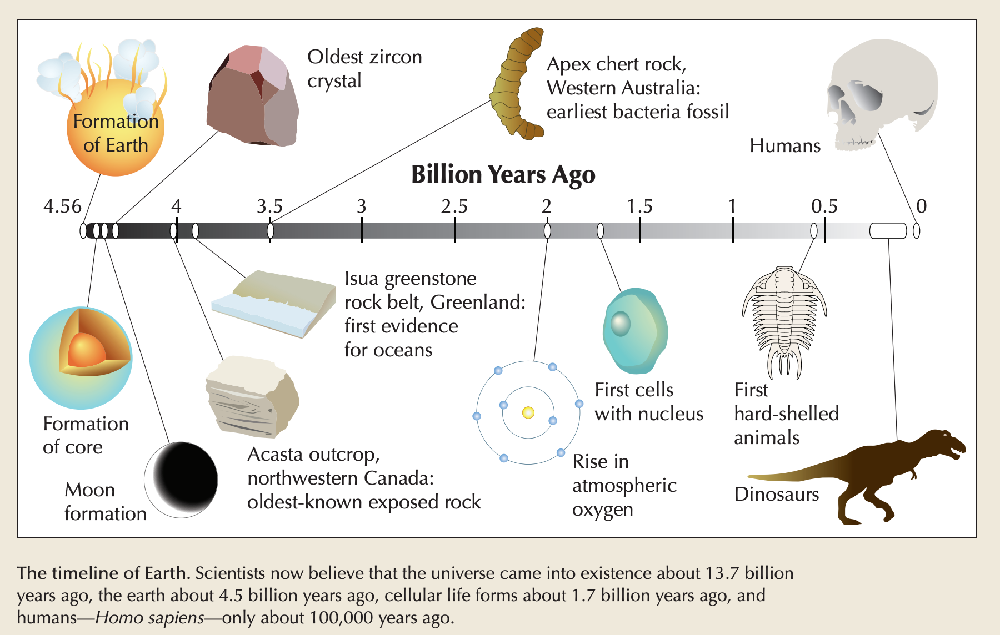

# TURNING POINT: HUMAN ORIGINS
> To 10,000 B.C.E.

## humankind Begins
Historians ask some very big questions. Of course, the stereotype of the historian as a person who searches in dusty archives for tiny, concrete bits of data is often correct. Detail and accuracy are important. Beneath this search for details, however, lie profound questions of fundamental importance. In this chapter we address some of the biggest questions of all: Where did humans come from? How did our collective life on earth begin? How are we similar to other living species, and how are we unique? When and where should we begin our search? This is one of the hottest questions in the study of world history today. It was not always so. (For non-historians it may be surprising, but historical questions are not settled once and for all.) Until the mid-nineteenth century, stories, often in the form of religious traditions, provided the answers to our questions about human origins and the meaning and purpose of human life. The a reevaluation of religious and narrative traditions invited a search for alternative explanations.

* reevaluation: the process or act of judging or calculating the quality, importance, amount, or value of something for a second, third, etc. time. 重新评估。

